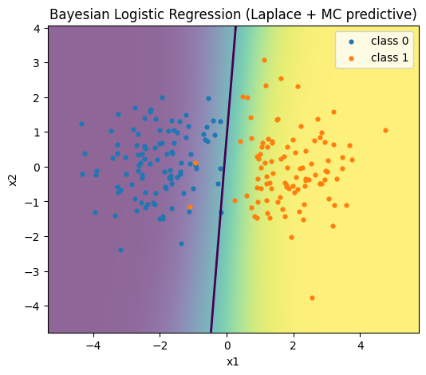
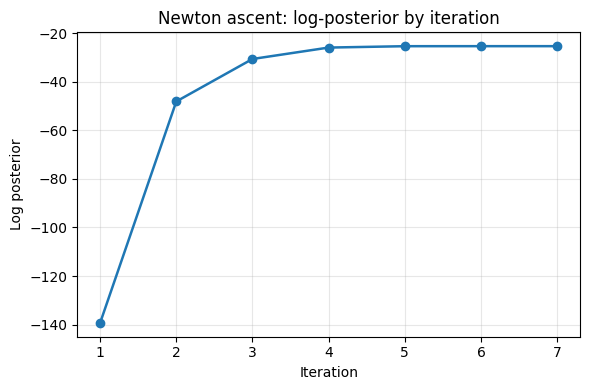

```python
import numpy as np

from bayes_fp import newton_map_logistic, laplace_covariance, predictive_laplace_mc, sigmoid

rng = np.random.default_rng(0)
n0 = n1 = 100
X0 = rng.normal(size=(n0,2)) + np.array([-2.0,0.0])
X1 = rng.normal(size=(n1,2)) + np.array([2.0,0.0])
X = np.vstack([X0,X1])
X = np.c_[np.ones(len(X)),X]
y = np.r_[np.zeros(n0), np.ones(n1)]


w_hat, H_hat, info = newton_map_logistic(X, y, sigma0 = 0.5, verbose = True)
Sigma = laplace_covariance(H_hat)

Xnew = np.c_[np.ones(3), np.array([[-3, 0], [0, 0], [3, 0]])]
probabilities = predictive_laplace_mc(Xnew, w_hat, Sigma, nsamples = 5000, seed = 1)
print("Predicted probabilities at new locations:", probabilities)
print("MAP estimate:", w_hat)
```

    iter 1 lp=-139.306810 ||step||=8.050e-01 t=1.00e+00
    iter 2 lp=-48.057961 ||step||=5.374e-01 t=1.00e+00
    iter 3 lp=-30.558037 ||step||=4.434e-01 t=1.00e+00
    iter 4 lp=-25.852892 ||step||=2.197e-01 t=1.00e+00
    iter 5 lp=-25.288095 ||step||=3.531e-02 t=1.00e+00
    iter 6 lp=-25.277596 ||step||=7.188e-04 t=1.00e+00
    iter 7 lp=-25.277592 ||step||=2.874e-07 t=1.00e+00
    Predicted probabilities at new locations: [0.00362788 0.53624058 0.99728352]
    MAP estimate: [ 0.15209971  2.02803149 -0.17091209]
    


```python
# Visualization of Bayesian logistic regression decision surface + uncertainty
# using the user's uploaded bayes_fp.py (Laplace + Monte Carlo predictive).
#
# This cell will:
# 1) Import bayes_fp from /mnt/data
# 2) Generate a simple 2-blob dataset (same as earlier)
# 3) Fit MAP via Newton, compute Laplace covariance
# 4) Monte Carlo posterior predictive over a grid
# 5) Plot a probability heatmap with the 0.5 decision contour and training points

import sys, importlib, types
import numpy as np
import matplotlib.pyplot as plt

# --- import the user's module from /mnt/data ---
if "/mnt/data" not in sys.path:
    sys.path.append("/mnt/data")

import bayes_fp
importlib.reload(bayes_fp)  # ensure latest edits are loaded

# --- helper: fetch a function with possible alias names ---
def get_any(module: types.ModuleType, names):
    for name in names:
        if hasattr(module, name):
            return getattr(module, name)
    raise AttributeError(f"None of the expected names found: {names}")

# Try to get the functions (supporting the user's possible renames)
newton_map_logistic = get_any(bayes_fp, ["newton_map_logistic", "newton_map", "map_logistic"])
laplace_covariance = get_any(bayes_fp, ["laplace_covariance", "laplace_cov"])
predictive_mc = get_any(bayes_fp, ["predictive_proba_laplace_mc", "predictive_laplace_mc", "predictive_mc_laplace"])

# --- 2D synthetic blobs ---
rng = np.random.default_rng(0)
n0 = n1 = 100
X0 = rng.normal(size=(n0, 2)) + np.array([-2.0, 0.0])
X1 = rng.normal(size=(n1, 2)) + np.array([+2.0, 0.0])
X = np.vstack([X0, X1])
X = np.c_[np.ones(len(X)), X]  # add bias
y = np.r_[np.zeros(n0), np.ones(n1)]

# --- Fit MAP & Laplace ---
w_hat, H_hat, info = newton_map_logistic(X, y, sigma0=0.5, verbose=False)
Sigma = laplace_covariance(H_hat)

# --- Build a grid over feature space (x1, x2) ---
x1_min, x1_max = X[:,1].min()-1.0, X[:,1].max()+1.0
x2_min, x2_max = X[:,2].min()-1.0, X[:,2].max()+1.0
nx, ny = 200, 200
gx = np.linspace(x1_min, x1_max, nx)
gy = np.linspace(x2_min, x2_max, ny)
G1, G2 = np.meshgrid(gx, gy)
G = np.c_[np.ones(G1.size), G1.ravel(), G2.ravel()]

# --- Monte Carlo predictive on the grid (batch to save memory) ---
def predictive_grid(Xgrid, batch=20000, nsamples=5000, seed=42):
    probs = np.empty(Xgrid.shape[0], dtype=float)
    start = 0
    while start < Xgrid.shape[0]:
        end = min(start + batch, Xgrid.shape[0])
        probs[start:end] = predictive_mc(Xgrid[start:end], w_hat, Sigma, nsamples=nsamples, seed=seed+start)
        start = end
    return probs

grid_probs = predictive_grid(G, batch=20000, nsamples=3000, seed=123)
Z = grid_probs.reshape(G1.shape)

# --- Plot: probability heatmap, decision contour, and training points ---
fig, ax = plt.subplots(figsize=(6, 5))

# Heatmap of class-1 probability
im = ax.imshow(
    Z,
    extent=[x1_min, x1_max, x2_min, x2_max],
    origin="lower",
    aspect="auto",
    alpha=0.6,
)

# 0.5 decision boundary
cs = ax.contour(gx, gy, Z, levels=[0.5], linewidths=2)

# Training points
ax.scatter(X0[:,0], X0[:,1], s=12, label="class 0")
ax.scatter(X1[:,0], X1[:,1], s=12, label="class 1")

ax.set_xlabel("x1")
ax.set_ylabel("x2")
ax.set_title("Bayesian Logistic Regression (Laplace + MC predictive)")
ax.legend(loc="upper right")

plt.show()

# Also print a brief summary for the user
print("Converged:", info.get("converged", None), "iters:", info.get("num_iter", None))
print("MAP:", np.array2string(w_hat, precision=4))


```


    

    


    Converged: True iters: 7
    MAP: [ 0.1521  2.028  -0.1709]
    


```python
from sklearn.linear_model import LogisticRegression
from sklearn.metrics import log_loss

# Fit sklearn logistic regression (MLE)
clf = LogisticRegression(penalty=None, solver="lbfgs", max_iter=1000)
clf.fit(X, y)

# Predictions from sklearn
p_sklearn = clf.predict_proba(X)[:, 1]

# Predictions from your MAP estimate (already computed above)
p_map = sigmoid(X @ w_hat)

# Compare log-loss (lower is better)
print("Log-loss (MAP):     ", log_loss(y, p_map))
print("Log-loss (sklearn):", log_loss(y, p_sklearn))

```

    Log-loss (MAP):      0.08134852109328876
    Log-loss (sklearn): 0.056518983606605976
    


```python
import numpy as np
import matplotlib.pyplot as plt

lp = info["logpost_hist"]
iters = np.arange(1, len(lp) + 1)

plt.figure(figsize=(6,4))
plt.plot(iters, lp, marker="o", linewidth=1.8)
plt.xlabel("Iteration")
plt.ylabel("Log posterior")
plt.title("Newton ascent: log-posterior by iteration")
plt.grid(alpha=0.3)
plt.tight_layout()
plt.show()

```


    

    

